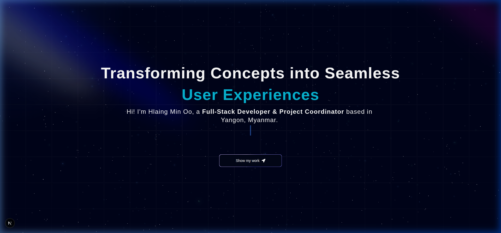

# <p align="center">🚀 Premium 3D Developer Portfolio & Admin Ecosystem</p>

<p align="center">
  
</p>

<p align="center">
  <b>A high-end, cinematic developer portfolio engineered for speed, immersion, and seamless content management.</b>
</p>

<p align="center">
  
  
  
  
  
</p>

---

## 💎 Core Pillars

### � Immersive 3D Experience
*   **Cosmic Background**: A floating galactic particle field built with `@react-three/fiber` that reacts subtly to scroll and movement.
*   **Perspective Interaction**: Project cards that physically tilt and "pop" along the Z-axis using Aceternity UI's 3D container.
*   **Folding Navigation**: Page sections that rotate and scale in 3D space as they enter the viewport, creating a "folding" physical feel.

### ⚡ Performance & Motion
*   **AnimeJS v4 Engine**: High-performance staggered spring animations for section entries, replacing standard CSS transitions for a "premium" tactile feel.
*   **Instant Load Sequence**: A custom `<Atom />` loading sequence that ensures the initial assets (3D models, heavy SVGs) are perfectly ready before revealing the page.
*   **Bento Layout**: A systematic, high-density grid layout that adapts flawlessly from massive 4K monitors down to mobile devices.

### 🛠 Enterprise Admin Dashboard
*   **Unified Command Center**: A full-fledged dashboard to manage every byte of data — from blog posts to technical skills.
*   **Live Metrics**: Instant visibility into content counts and system status.
-   **Security**: Military-grade Content Security Policy (CSP) and bcrypt-protected local authentication.

---

## 🛠 Tech Stack & Architecture

| Layer | Technology |
|---|---|
| **Frontend** | [Next.js](https://nextjs.org/) (App Router), [React 19](https://react.dev/) |
| **3D Engine** | [Three.js](https://threejs.org/), [React Three Fiber](https://r3f.docs.pmnd.rs/getting-started/introduction) |
| **Motion** | [Framer Motion](https://www.framer.com/motion/), [Anime.js v4](https://animejs.com/) |
| **Database** | [MongoDB Atlas](https://www.mongodb.com/atlas/database) (Mongoose) |
| **State** | [Zustand](https://github.com/pmndrs/zustand) |
| **Styling** | [Tailwind CSS](https://tailwindcss.com/) |

---

## 🚀 Quick Start (Local Setup)

### 1. Requirements
Ensure you have **Node.js 18+** and a **MongoDB** connection string.

### 2. Installation
```bash
git clone https://github.com/dev-hmo/your-repo.git
cd your-repo
npm install
```

### 3. Environment Config
Create a `.env.local` and populate it:
```env
MONGODB_URI=your_mongodb_uri
ADMIN_PASSWORD=your_admin_password
JWT_SECRET=your_secret_random_string
```

### 4. Seed the Database
**IMPORTANT**: This step populates your MongoDB cluster with all initial 3D grid layout items and portfolio data.
```bash
npx tsx seed.mts
```

### 5. Launch
```bash
npm run dev
```

---

## � Deployment (Vercel)

The app is optimized for **Vercel**. 
1. Push your code to GitHub.
2. Link the project in Vercel.
3. Add your `.env` variables in Vercel's Dashboard.
4. Deployment will auto-build using the optimized Turbopack engine.

---

## 👨‍💻 Author

**Hlaing Min Oo**
- **GitHub**: [@dev-hmo](https://github.com/dev-hmo)
- **LinkedIn**: [Hlaing Min Oo](https://linkedin.com/in/hlaing-min-oo-656369240)

---

<p align="center">
  <i>Developed with precision and passion by Hlaing Min Oo.</i>
</p>
